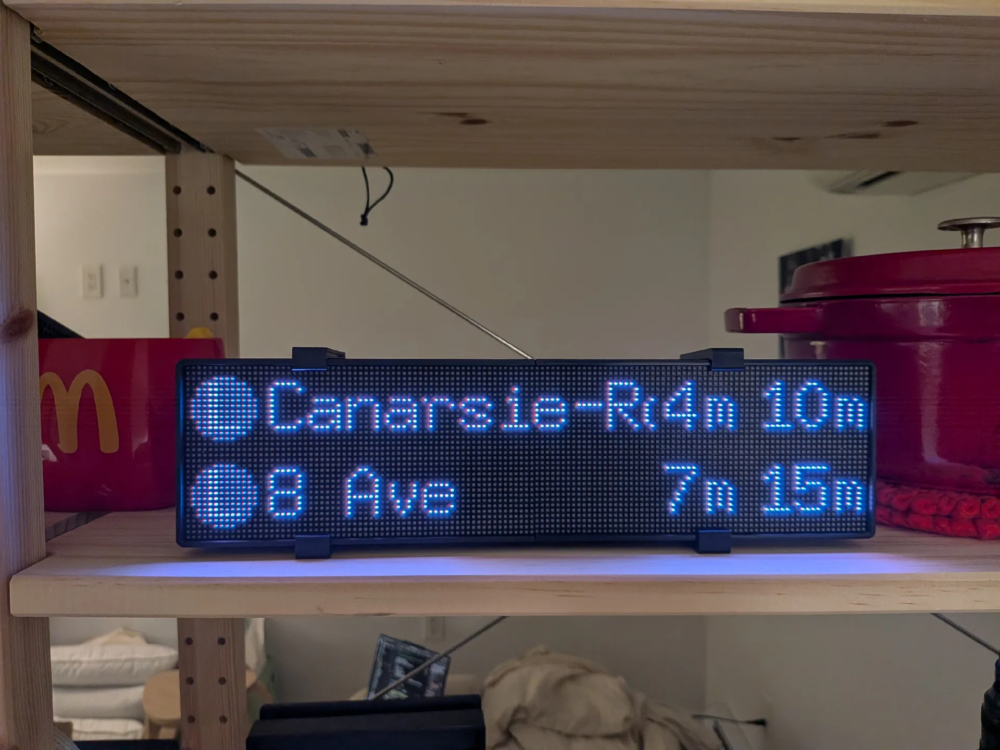
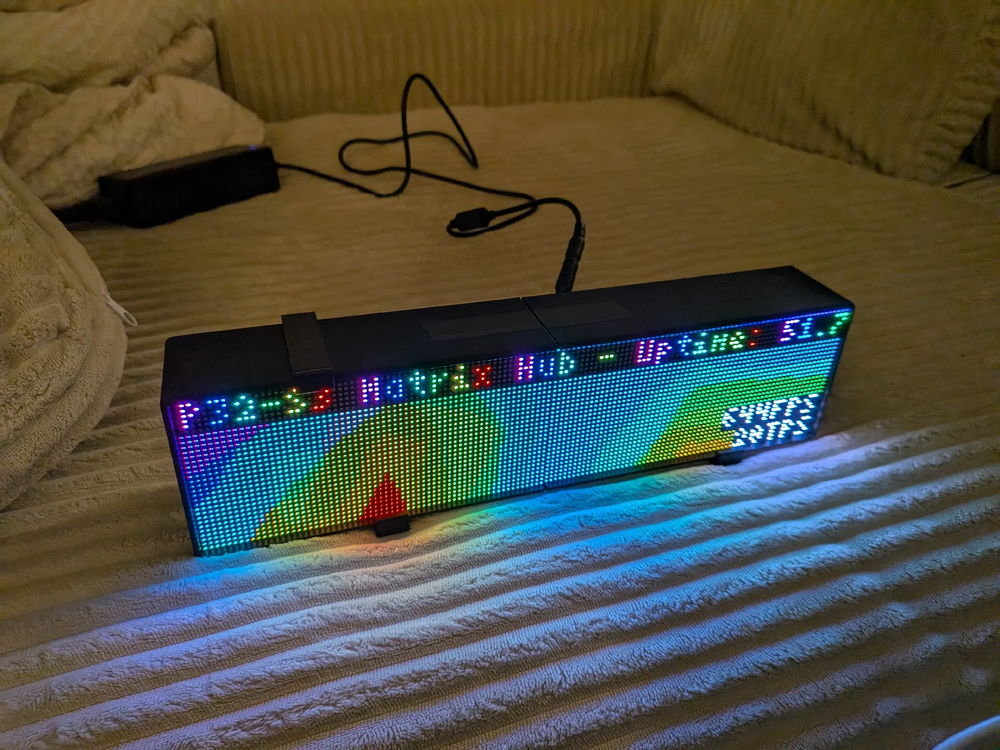
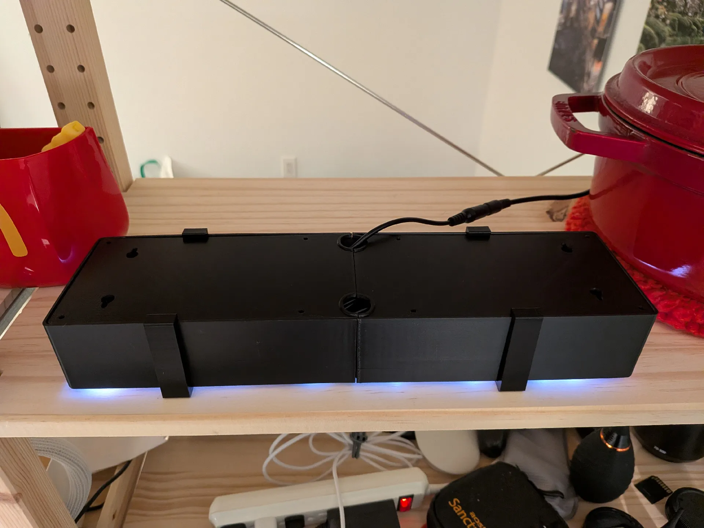

# Matrix Hub


An embedded Rust application for the Adafruit MatrixPortal S3 that drives a 128x32 HUB75 LED matrix display with WiFi-connected apps including NYC MTA subway arrivals, plasma effects, and physics simulations.

## Features

**Hardware Support:**

- Adafruit MatrixPortal S3 (ESP32-S3 based)
- 128x32 HUB75 RGB LED matrix (4-bit color depth)
- LIS3DH accelerometer via I2C (STEMMA QT connector)
- Two physical buttons (UP/DOWN) for app rotation
- WiFi connectivity with async HTTP/TLS client
- Optional: [3D printable enclosure by Pavel Smalec](https://www.printables.com/model/1535209-enclosure-for-128x32-p25-rgb-led-matrix-panel)

**Apps:**

- **MTA** - Real-time NYC subway arrival predictions from GTFS-RT feeds
- **Plasma** - Animated plasma effect visualization
- **Sandbox** - Physics simulation with accelerometer-based gravity

**Runtime:**

- Dual-core async execution using Embassy
- Core 0: WiFi, apps, HTTP server, SNTP time sync
- Core 1: Display rendering at ~50 FPS, HUB75 DMA refresh at 500+ FPS
- Automatic app rotation with configurable intervals
- Web-based configuration interface on port 80
- Persistent configuration storage in NVS flash

## Building & Flashing

**Prerequisites:**

- Rust with ESP toolchain (see `rust-toolchain.toml`)
- `espflash` CLI tool: `cargo install espflash`

**Build and flash:**

```bash
# Create a .env file with your WiFi credentials
echo 'WIFI_SSID=YourNetworkName' > .env
echo 'WIFI_PASSWORD=YourPassword' >> .env

cargo run --release
```

The `.env` file is loaded at build time and used as the default configuration.

**Windows users:** You need to attach your USB device to WSL before flashing:

```powershell
# In PowerShell as Administrator, find your device bus ID:
usbipd list

# Attach it (adjust bus ID as needed):
usbipd attach --wsl --busid 1-1
```

## Configuration

### Initial Setup

Create a `.env` file in the project root with your WiFi credentials:

```bash
WIFI_SSID=YourNetworkName
WIFI_PASSWORD=YourPassword
```

These values are loaded at build time and used as the default configuration. The `.env` file is git-ignored for security.

### Web Interface

Once connected to WiFi, access the configuration web interface at the device's IP address on port 80. The interface provides:

- Main landing page with navigation
- Interactive JSON configuration editor with live validation
- Real-time device state viewer

Configuration changes made through the web interface are automatically persisted to flash storage and will survive reboots.

### Manual Configuration

You can also edit the default configuration in [src/bin/main.rs](src/bin/main.rs#L177-L179) before building.

## Demo




